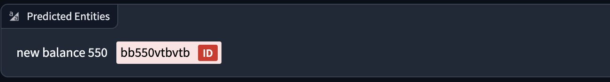

### 직면한 문제

제품 정보를 수집함에 있어 product id 확보가 매우 중요합니다. 동일한 제품이라도 수집중인 여러 편집샵 별 제품명이 상이하기 때문에 해당 브랜드 고유의 product id를 통해 통합하여 관리하여야 합니다.

이러한 product id는 대게 제품명에 포함되어 있으므로, 이를 추출하기 위해선 일정 패턴을 찾아 regex를 활용합니다.

하지만 아래의 예시와 같이 regex로 추출하기 까다로운 조건이 존재하곤 합니다. 이러한 예외에 해당하는 사례는 수천 개의 달하는 제품을 수집하는 경우 매우 흔하게 나타나므로 수집된 값을 사람이 일일이 변경해야하는 비효율이 발생합니다.

또한 새로운 편집샵을 수집하거나 새로운 제품을 수집할 때마다 Regex를 매번 새롭게 고민해야하는 점이 부담이었습니다.

```js
[
    {
        "productName": "adidas originals shoes handball spezial ig6194 blue", // product id : ig6194
    },
    {
        "productName": "adidas originals shorts sprinter shorts black", // product id : 없음
    },
    {
        "productName": "human made mail bag hm27gd032 olive", // product id : hm27gd032
    }
    {
        "productName": "new balance 550 bb550vtbvtb", // product id : bb550vtbvtb
    }

]

```

### 해결

평소 NLP 모델에 관심이 많아 HuggingFace를 방문해 어떠한 기능이 새로 나타났는지를 관심갖고 지켜봤습니다.

이중 Gliner라는 Keyword Extraction 모델을 발견해 제가 겪고 있는 문제를 해결해줄 것을 기대하였습니다.

다음은 Gliner 모델의 추론 결과입니다. [Gliner 데모](https://huggingface.co/spaces/urchade/gliner_multiv2.1)를 활용하였으며, product id 외에도 color 또한 구분하도록 조건을 설정하였습니다.

```js
    {
        "productName": "adidas originals shoes handball spezial ig6194 blue", // product id : ig6194
    },
```


```js
    {
        "productName": "adidas originals shorts sprinter shorts black", // product id : 없음
    },
```


```js
{
    "productName": "human made mail bag hm27gd032 olive" // product id : hm27gd032
}
```


```js
{
    "productName": "new balance 550 bb550vtbvtb" // product id : bb550vtbvtb
}
```



물론 이 모델 또한 완전한 자동화를 이룰 만큼 완벽한 결과를 보장하지 않으므로 일부 데이터를 일일이 변경해주어야 합니다. 하지만 그 양이 regex 대비 현저하게 감소했고, 다양한 패턴에 유연하게 대응 가능하다는 점에서 도입을 결정하였습니다.

그 결과 유의미한 작업 시간의 감소(30분 -> 3분)를 달성할 수 있었습니다.
